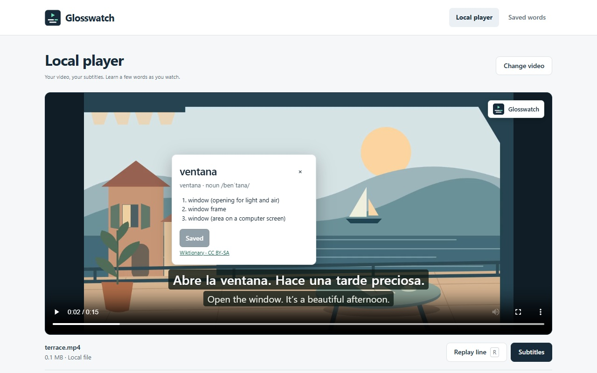
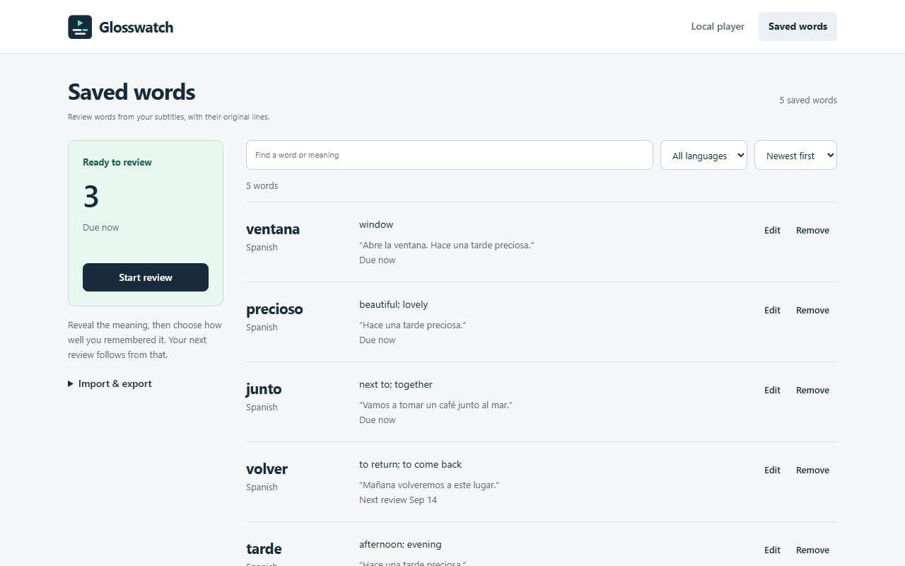
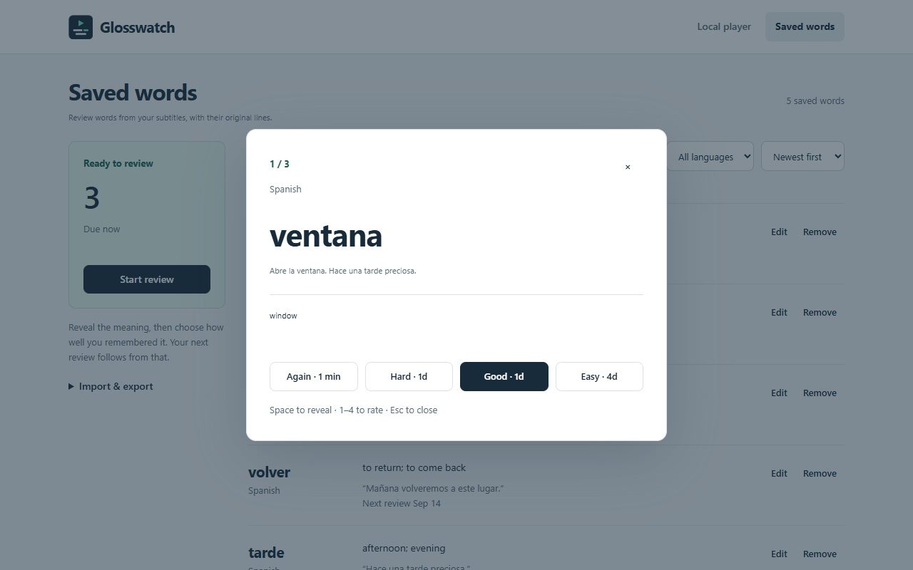

# Glosswatch

Learn words from the videos you already watch. Add your own subtitles, look up a
word in place, and keep it with its original line for review.

**Chrome & Firefox · Five offline dictionaries · No account or uploads**

[Setup](#setup) · [Try it](#try-it) · [Development](#development) · [Support](#limits--support)



## Watch, understand, remember

| While watching | After watching |
| --- | --- |
| Load SRT, VTT, ASS or SSA files | Save words with their subtitle context |
| Look up Spanish, French, German, Italian or Portuguese words in English | Review with Again, Hard, Good and Easy |
| Nudge timing, replay a line, or search the transcript | Search and edit your collection; undo changes |
| Add a second subtitle track | Back up to JSON or export for Anki |

<details>
<summary><strong>See the word collection and review screen</strong></summary>





</details>

No content library, accounts, analytics, or server. Video files and word lookups
stay on your device. MP4, WebM and MOV use the browser's player; supported MKV files
are prepared locally without re-encoding.

## Setup

The store listing is being prepared. You can install the current version from source.

### Chrome

Install **Node.js 22.12 or newer** and Git, then run:

```sh
git clone https://github.com/youssof20/glosswatch.git
cd glosswatch
npm ci
npm run build
```

1. Open `chrome://extensions` and turn on **Developer mode**.
2. Click **Load unpacked** and choose **`.output/chrome-mv3`** inside this repo.
3. Pin Glosswatch from Chrome's Extensions menu. Reload any video tabs already open.

Already have the Chrome release ZIP? Extract it and load the folder containing
`manifest.json` using the same steps. Keep that folder where it is.

### Firefox

Run `npm run build:firefox` in the same repo. Open
`about:debugging#/runtime/this-firefox`, choose **Load Temporary Add-on**, and select
`.output/firefox-mv3/manifest.json`. Firefox removes temporary add-ons on restart;
permanent installation needs the signed release.

## Try it

1. Open a web video, start playback, and click Glosswatch on the toolbar.
   For a file on your computer, choose **Local player → Choose video**.
2. Click **Add subtitles** and choose your SRT, VTT, ASS or SSA file.
3. Choose the subtitle language under **Word meanings**. Click or hover over a word,
   then **Save word**. Open **Saved words** to review it.

For a quick local demo, use [terrace.mp4](docs/demo/terrace.mp4) with
[terrace.srt](docs/demo/terrace.srt). Add [the English track](docs/demo/terrace.en.vtt)
as the translation. On GitHub, use **Download raw file** to save each file.

**Useful controls:** ±0.5-second timing buttons, **Replay line** (`R` in the local
player), **Next line**, and the searchable transcript. Use Glosswatch's **Full screen**
button to keep subtitles visible. Chrome file tabs need **Allow access to file URLs**;
the local player does not.

## Development

```sh
npm run dev
npm run compile
npm test
```

Use `npm run dev:firefox` for Firefox. If Chrome isn't installed, dev still starts;
load `.output/chrome-mv3-dev` manually. To select a binary, set `CHROME_PATH` or create
the ignored `web-ext.config.ts`:

```ts
import { defineWebExtConfig } from 'wxt';
export default defineWebExtConfig({
  binaries: { chrome: 'C:/path/to/chrome.exe' },
});
```

WXT passes `binaries.chrome` to web-ext's `chromiumBinary`.
Run `npm run zip` or `npm run zip:firefox` to create release packages in `.output/`.
Browser checks use `npm run test:browsers`, `npm run test:fixtures`, then
`npm run test:browser` and `npm run test:firefox` (ffmpeg must be on PATH).

## Limits & support

Browser-only pages and inaccessible video players cannot be overlaid. Image subtitles
and unsupported media codecs need a different file. Dictionaries provide word meanings,
not automatic sentence translation. ASS styling is reduced to plain text.

Maintained by **youssof20**. Support: [chuumberry@gmail.com](mailto:chuumberry@gmail.com).
[Privacy policy](docs/privacy.html).

## License

Original code and demo artwork: [MIT](LICENSE). Dictionary data: Wiktionary contributors,
[CC BY-SA 4.0](public/dictionaries/NOTICE.txt).
[Bundled dependency licenses](public/THIRD-PARTY-NOTICES.txt).
